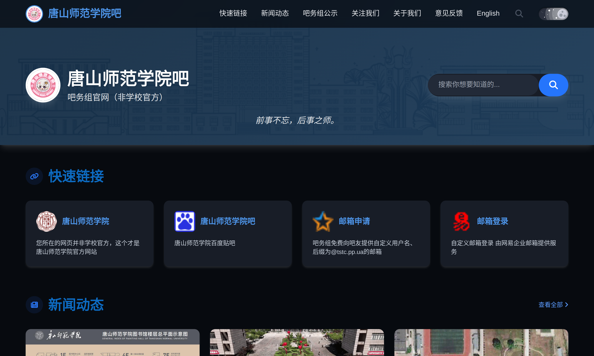
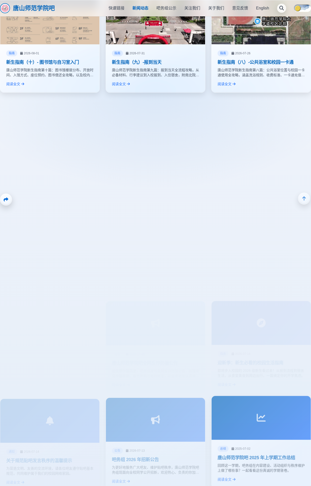
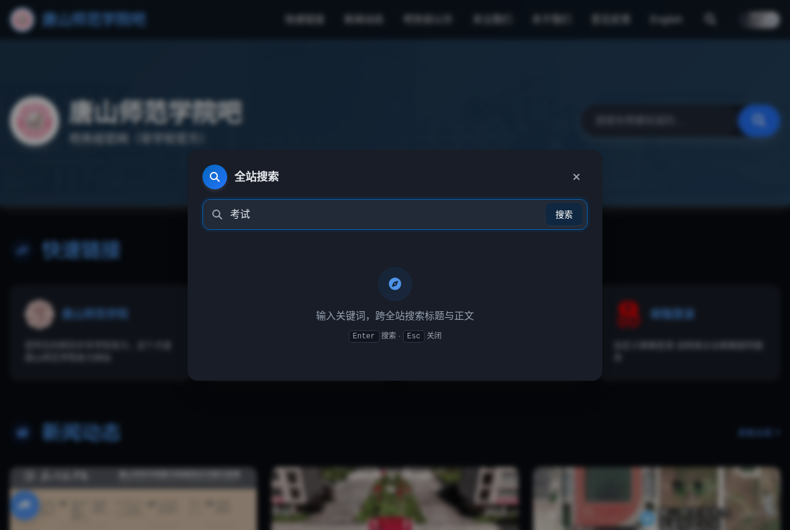

# 唐山师范学院吧 · 官网（静态站 + 新闻动态 + 站内搜索）

一个纯静态多页网站，构建时把 Tailwind 预编译为本地 CSS、内联关键样式，并生成一个**全站站内搜索索引**。无任何外部 CDN 依赖，可直接部署到 Cloudflare Pages。

站点定位：唐山师范学院吧务组官网（非学校官方），提供快速链接、吧务组公示、新闻动态与意见反馈。

## 近期更新亮点

完整历史见仓库根目录 `CHANGELOG.md`。近期重点：

- **2026-08-03 全站液态玻璃（Liquid Glass）设计**：参考 iOS 26 设计理念，全站按钮（顶栏搜索 / 汉堡、主按钮 / 胶囊 CTA、返回顶部、分享浮标、幽灵按钮）与全站卡片（快捷链接、吧务组公示、新闻列表、相关阅读）统一叠加半透明表面 + 折射模糊 + 白色高光边框 + 内发光；分享主按钮与返回顶部采用白色毛玻璃 + 品牌色图标的强镜面质感。移动端顶栏修复（搜索按钮改正圆、主题切换不再显小、标题完整不省略、三按钮正常尺寸单行）。平台色二维码按钮保留品牌色并叠加玻璃，白字可读。二维码与意见反馈弹窗统一为居中玻璃面板。
- **2026-08-02 全站暗色模式 + 昼夜滑动开关**：导航栏新增太阳 / 月亮纯 CSS 滑动切换开关；所有表面、卡片、阴影、搜索弹窗同步适配夜间主题；自动跟随系统 `prefers-color-scheme`，选择后记忆到 `localStorage`；构建时将防闪烁脚本注入 `<head>` 首位，避免暗色用户刷新白屏。
- **2026-07-31 新生指南（九）-报到当天**：新增中英双语文章，含北院 / 南院校区地图、迎新帐篷、食堂等 5 张配图与防骗提醒。
- **2026-07-31 阅读体验增强**：文章显示阅读时长；新闻列表增加分类筛选标签；文章内图片点击可灯箱放大（打开上浮淡入、关闭反向弹出）；文章顶部增加面包屑与文末「相关阅读」推荐（已修复英文版误列当前文章）。
- **2026-07-28 唐山大地震五十周年悼念**：全站自动置灰一天（7/28 00:00–7/29 00:00 自动恢复），顶栏加悼念标语。
- **2026-07-27 站内搜索引擎上线**：构建期生成索引，支持标题 + 全文检索、命中高亮、中英文各自独立检索。
- **2026-07-23 全站英文版上线**：所有页面（含新闻详情）均提供 English 版本，顶栏自动注入语言切换。
- **2026-07-14 网站正式上线**：新闻动态模块可用，首页 / 列表零配置自动同步，可部署至 Cloudflare Pages。

## 功能特性

- **暗色模式与昼夜滑动开关**：导航栏内置纯 CSS 太阳 / 月亮滑动切换开关，所有表面、卡片、阴影、搜索弹窗均有过渡动画；首次访问自动跟随系统 `prefers-color-scheme`，用户选择后记忆到 `localStorage`；构建脚本将防闪烁脚本注入 `<head>` 首位，避免暗色用户刷新时出现白屏。
- **站内搜索引擎**：顶栏（桌面端导航、移动端顶栏）及首页头部均可打开搜索，跨全站检索标题与正文，结果弹层带高亮片段与可点击跳转，中英文各自独立检索。
- **双语站点**：所有页面均有中文版与英文版（文件名加 `-en` 后缀），顶栏自动注入「中文 / English」切换按钮。
- **新闻动态自动同步**：新增 / 修改 `news/` 下文章即自动更新首页与列表页，无需维护列表文件。现已累计 14 篇（中 / 英各 14 篇）。
- **上一篇 / 下一篇导航**：文章末尾按日期自动串联，由构建脚本统一管理。
- **图片灯箱（Lightbox）**：文章内图片点击放大查看，打开上浮淡入、关闭反向弹出，与首页弹窗风格一致。
- **文章面包屑 + 相关阅读**：文章顶部显示「首页 › 新闻动态 › 标题」面包屑（英文页正确跳转英文对应页）；文末按同分类优先推荐「相关阅读」，并排除当前文章。
- **文章阅读时长**：文章头部显示预计阅读时长（中文「约 X 分钟阅读」/ 英文「X min read」）。
- **新闻列表分类筛选**：列表页顶部提供分类标签，一键筛选对应分类文章。
- **更新日志弹窗**：页脚「版权所有」后新增「更新日志」入口，点击弹窗展示按日期归档的全部更新记录（支持 Esc / 点击遮罩关闭）。
- **悼念置灰（临时）**：特定纪念日（如唐山大地震五十周年）全站自动置灰并在顶栏显示悼念标语，到点自动恢复。
- **响应式 + 无外部依赖**：Tailwind 本地预编译、Font Awesome 本地托管，首屏关键 CSS 内联，加载快且稳定。
- **意见反馈 / 社交账号弹窗**：二维码弹窗、反馈邮箱弹窗等。
- **液态玻璃（Liquid Glass）设计语言**：参考 iOS 26，全站按钮、卡片与弹窗采用半透明表面 + `backdrop-filter` 折射模糊 + 白色高光边框 + 内发光，配合按压缩放反馈；平台色按钮保留品牌色再叠玻璃，分享 / 返回顶部使用白色毛玻璃 + 品牌色图标，卡片用磨砂玻璃质感，质感统一。

## 设计与视觉展示

下面是部分关键组件与页面效果的实拍图，可直接看到网站在亮色 / 暗色主题下的表现。

### 昼夜滑动开关

一个纯 CSS 实现的单元素太阳 / 月亮切换开关：白天显示太阳与云朵，夜晚显示月球陨石坑与白色光晕，点击后整站主题平滑过渡。

| 亮色 · 白天 | 暗色 · 夜晚 |
| --- | --- |
|  |  |

### 明暗双主题首页

首页 Hero 区域、快速链接卡片、新闻预览在暗色模式下会统一切换到深色调，卡片阴影从深色投影反转为白色柔和光晕，保持层级感。

| 亮色主题 | 暗色主题 |
| --- | --- |
|  |  |

### 新闻卡片

新闻列表采用大封面 + 分类标签 + 日期 + 摘要的卡片布局，悬停有轻微上浮阴影；构建期自动提取文章信息生成封面、标题与摘要。



### 全站搜索弹窗

桌面端与移动端均可调出搜索弹窗，输入关键词后即时高亮命中片段。暗色模式下弹窗背景、输入框与按钮均自动适配，不会出现输入框变白的问题。

| 亮色搜索 | 暗色搜索 |
| --- | --- |
|  |  |

### 移动端夜间模式

移动端导航栏保留了滑动开关与搜索入口，所有组件在窄屏下重新排布，暗色主题同样完整生效。


## 技术栈

- **纯静态多页**：HTML + 原生 JS，无框架、无后端
- **Tailwind CSS v3.4.19**：本地 CLI 预编译（`assets/style.css`），不在浏览器里跑 CDN
- **Font Awesome 6.7.2**：本地托管于 `assets/fontawesome/`，无外部请求
- **关键 CSS 内联**：首屏关键样式写入 `assets/critical.css` 并内联进每个页面 `<head>`，全量 `style.css` 异步加载，首屏更快
- **构建期生成搜索索引**：`build/generate-manifest.js` 扫描全站页面，产出 `assets/search-index.json`（中 / 英两套），前端 `assets/main.js` 加载并检索

## 目录结构

```
index.html / index-en.html              首页（搜索框 + 新闻动态预览 + 快速链接）
news.html / news-en.html                新闻列表页
about.html / about-en.html              关于我们页面
dzl.html / dzl-en.html                  自定义「页面不存在」错误页（不进入搜索索引）
404.html / 404-en.html                  标准 404 错误页（不进入搜索索引）
news/post-1.html … post-14.html         文章详情页（中文共 14 篇）
news/post-1-en.html … post-14-en.html   对应英文版（英文共 14 篇）
build/                                  构建脚本与配置集中目录（不参与线上部署）
  tailwind.config.js      Tailwind 配置（含 safelist，保证动态类不被清除）
  tailwind-input.css      Tailwind 入口样式（被编译为 assets/style.css）
  build-critical-css.py   生成并内联关键 CSS
  generate-manifest.js    构建脚本：编译清单、注入上一篇/下一篇导航、生成搜索索引、内联资源版本
news-manifest.json / news-manifest-en.json   新闻清单（自动生成）
assets/style.css          全站共用样式（构建生成）
assets/critical.css       首屏关键样式（构建生成）
assets/main.js            全站共用脚本（导航、弹窗、新闻渲染、站内搜索、更新日志）
assets/news-version.js    清单版本号（自动生成，用于缓存击穿）
assets/search-index.json  全站搜索索引（构建生成，中/英两套，含内容哈希版本）
assets/fontawesome/       Font Awesome 本地字体与样式
CHANGELOG.md              按日期归档的全部更新记录
images/                   README 配图（手动维护）
```

> 说明：`news-manifest.json`、`news-manifest-en.json`、`assets/news-version.js`、`assets/style.css`、`assets/critical.css`、`assets/search-index.json` 均由构建脚本自动生成，无需手写，也不要手动修改。

## 站内搜索（工作原理）

搜索是**构建期生成索引 + 浏览器端检索**，不依赖后端、不产生额外请求：

1. **构建期**：`build/generate-manifest.js` 扫描所有真实站点页面（根目录 `.html` 与 `news/*.html`），对每个页面提取 `<title>` 与 `<main>` 正文（已剔除 `<style>`/`<script>`、顶栏导航、页脚、上一篇 / 下一篇区块、返回按钮等公共骨架，并排除 404 / dzl 等错误页），生成 `assets/search-index.json`，按语言拆分为 `zh` / `en` 两套，并附带内容哈希版本号。
2. **运行期**：`assets/main.js` 加载一次索引并缓存；在标题 + 正文中做大小写不敏感的子串匹配，标题命中者排序靠前；弹出结果面板，每条显示标题、带 `<mark>` 高亮的关键词片段（命中处前后各约 70 字）与可点击链接。
3. **语言隔离**：中文页面只搜索中文页面，英文页面只搜索英文页面。
4. **入口**：首页头部搜索框、顶栏导航搜索图标（桌面端在导航末尾、移动端在汉堡菜单左侧）。按 ESC 或点击遮罩关闭。
5. **路径**：结果链接与索引地址均使用站点根绝对路径，因此在文章详情页、关于页等任意层级页面都能正确加载并跳转。

## 本地构建与预览

本项目样式是**构建期预编译**的，本地预览前需要先构建一次：

```bash
npm install          # 首次拉取依赖（tailwindcss、fontawesome）
npm run build        # 编译 Tailwind + 内联关键 CSS + 生成清单 + 生成搜索索引 + 注入导航
```

构建完成后，直接双击 `index.html` 即可在浏览器打开；若浏览器对本地文件有限制，可启动静态服务器：

```bash
python3 -m http.server 8080
# 然后访问 http://localhost:8080
```

## 部署到 Cloudflare Pages

方式一：连接 Git 仓库（推荐，自动同步）
1. 把这些文件推送到 GitHub 仓库。
2. Cloudflare Pages 连接该仓库：
   - **构建命令**：填 `npm run build`
   - **输出目录**：填 `.`（根目录）
3. 保存并部署。之后每次 `git push` 都会自动重新构建、扫描 `news/` 生成清单与搜索索引并重新部署，首页、列表页、搜索结果随之同步。

方式二：控制台拖拽上传
1. 本地先运行 `npm run build` 生成全部产物。
2. 登录 Cloudflare 控制台 → Pages → 「创建项目」→「直接上传」。
3. 把本目录整体拖入上传区，构建设置保持默认（无需构建命令、无需输出目录）。
4. 部署完成后得到一个 `*.pages.dev` 域名。

> 自定义 404：Cloudflare Pages 会自动把根目录下的 `404.html` 当作 404 页面，任何不存在的路径都会展示它并返回标准 404 状态码（已有页面与静态资源不受影响），无需额外配置。

## 新闻动态（自动同步，无需维护列表）

每篇文章是一个独立 HTML 文件（`news/post-x.html`），文件顶部有一段 `#articleMeta` 元信息（标题 / 日期 / 分类 / 作者 / 摘要）。
`build/generate-manifest.js` 在构建时扫描 `news/` 目录、提取元信息、生成 `news-manifest.json`（及英文版）；首页与新闻列表页读取该清单自动渲染卡片。
因此新增 / 修改文章**只需动 `news/` 下的 HTML 文件，不需要改任何列表文件**。

### 上一篇 / 下一篇导航（自动生成）

构建脚本会根据文章日期，自动在每篇文章末尾的「返回新闻列表」上方注入上一篇 / 下一篇导航，按日期串联所有 `post-N` 文章（最新一篇的下一篇显示「已是最新」）。
导航用 `<!-- AUTO_PREV_NEXT_START -->` … `<!-- AUTO_PREV_NEXT_END -->` 标记包裹，**由脚本统一管理，请勿手动修改该区块**；脚本会在每次构建时清除旧块并重写，保证链接始终正确。

### 如何新增一篇新闻

1. 复制 `news/post-1.html` 为一个新文件，例如 `news/post-15.html`（同时建议提供英文版 `news/post-15-en.html`）。
2. **只改两处，其余原样保留**：
   - **文件顶部 `#articleMeta` 元信息**（必须保留整个 `<script id="articleMeta">` 块，仅替换里面的字段值）：
     ```html
     <script id="articleMeta" type="application/json">
     {
       "title": "文章标题",
       "date": "2026-08-01",
       "category": "指南",          <!-- 分类：中文用 公告/通知/指南/总结/活动；英文用 Announcement/Notice/Guide/Summary/Activity -->
       "author": "TSNU Bar Mod Team",
       "excerpt": "一句话摘要，显示在卡片与搜索结果里",
       "cover": "assets/images/xxx.jpg"   <!-- 封面图（可选）：留空时构建会自动取文章正文中第一张非二维码/非品牌图作为封面；也可在此手动指定以强制覆盖 -->
     }
     </script>
     ```
   - **`<main>` 内的正文**（自由编辑，可加图片；正文图片请加上 `loading="lazy"` 以加快加载，例如 ``）。
3. 其余骨架（顶栏导航、上一篇 / 下一篇、页脚、返回按钮、脚本引用等）**一律不要改**，构建脚本会自动处理。
   - 首页与列表页会直接读取这段元信息，**不需要再改任何列表文件**。
   - 上一篇 / 下一篇导航会在构建时自动按日期重排，无需手动维护。
   - 搜索索引会在构建时自动包含新文章（全文可被检索）。
4. 运行 `npm run build` 并提交推送：Cloudflare 会自动构建并重新部署，首页、列表页与搜索结果立即同步。

## 缓存说明

`_headers` 已配置合理的缓存策略：页面 / 脚本 / 清单只缓存 1~5 分钟，样式表缓存 1 天（兼顾加载速度与更新及时性）。
`main.js` 读取新闻清单与搜索索引时会自动加内容哈希版本并禁用缓存，因此新增文章 / 调整搜索索引通常能在几分钟内显示，无需手动清缓存。
若偶尔仍看到旧内容，可硬刷新（Ctrl/Cmd + Shift + R），或到 Cloudflare 控制台 **Caching → Purge Everything** 清一次缓存即可。
